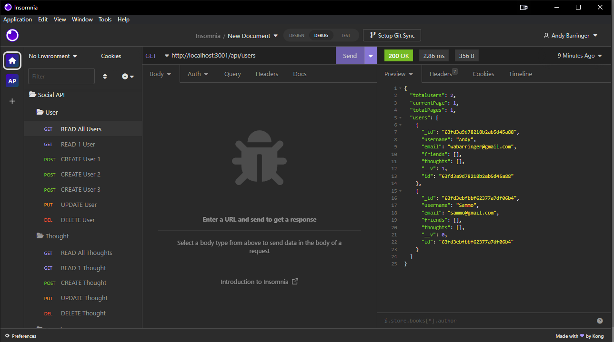

# social-network-api

## Description

- What was your motivation?
  - To build an API using MongoDB
- Why did you build this project?
  - I wanted to see if I'd prefer MongoDB over SQL. I'm still undecided, and it probably will depned on my future projects.
- What problem does it solve?
  - Uses MongoDB to create the backend of a Social Media web app
- What did you learn?
  - How to use MongoDB more effectively

## Installation

- Requires installing these npm packages:

  - dotenv
  - express
  - mongoose
  - validator

- Run server by inputing nodemon or node server.js

## Usage

- Use insomnia to get, create, update or delete user and thought data. You can also Create and delete reactions/comments to thoughts, and add or delete friends.

- Demo video https://drive.google.com/file/d/14Teuoux12muFi0NCEHhx2F7aw75pkOWS/view

- 

## Credits

- Tools used: Insomnia - to test routes

## License

N/A
